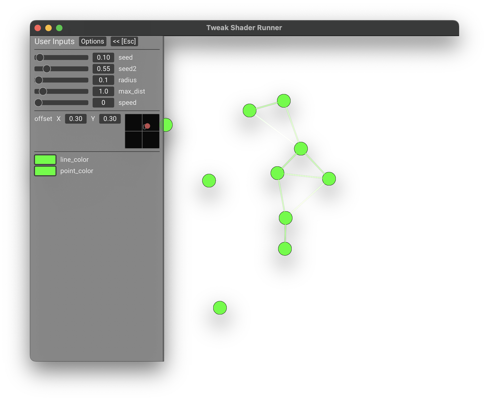
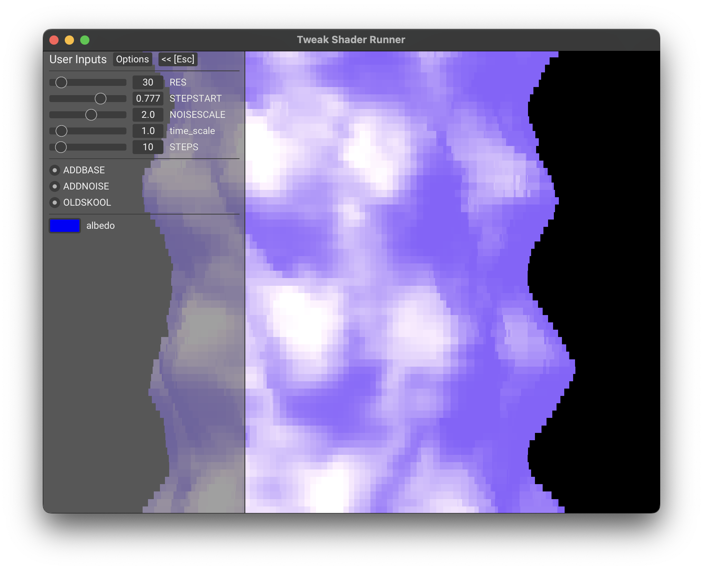
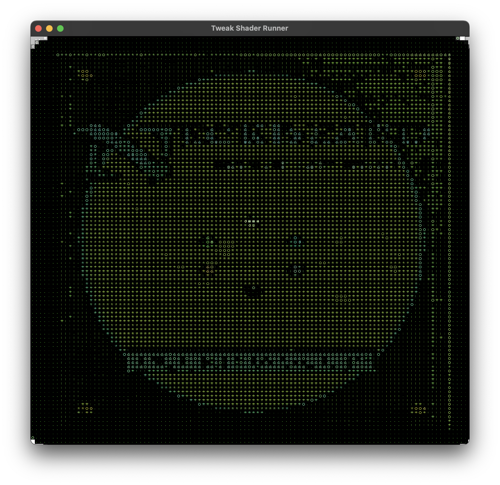

## Lib Tweak Shader

[](https://docs.rs/tweak_shader)
[](https://crates.io/crates/tweak_shader)

 <div style="display: flex; flex-direction: row; justify-content: space-between;">
  
  
  
</div>

### Description

The tweak shader library provides a [wgpu](https://github.com/gfx-rs/wgpu) rendering and bookkeeping context for an interative screen shader format.
It allows users to create shaders reminiscent of ShaderToy or ISF shaders with custom uniforms that can be tweaked at runtime. This can be used for 
composable post processing effects, generative art, reactive visuals and animation, it is intended for inclusion in other wgpu based creative software.
It features video, image, and audio inputs, as well as a small selection of other types, such as colors, floats, ints, 2d points, and more.
This Library and it's features were modeled after [ISF](https://github.com/mrRay/ISF_Spec)

This has some notable differences from other glsl based screen shader environments. 
* It is vulkan-like, UV's and FragCoords increase going down the screen.
* It is built on wgpu and naga. This means it enforced uniformity of control flow and will throw a validation error if you try to do things
like access a texture in a conditional block.

### Usage

```Rust 
 use tweak_shader::RenderContext;
 use wgpu::TextureFormat;

 let src =  r#"
#version 450
#pragma tweak_shader(version=1.0)

layout(location = 0) out vec4 out_color;

#pragma input(float, name="foo", default=0.0, min=0.0, max=1.0)
#pragma input(float, name="bar")
#pragma input(float, name="baz", default=0.5)
layout(set = 0, binding = 0) uniform Inputs {
    float foo;
    float bar;
    float baz;
};

void main()
{
    out_color = vec4(foo, bar, baz, 1.0);
}
"#;

 let format = TextureFormat::Rgba8UnormSrgb;
 let device = // your wgpu::Device here;
 let queue = // your wgpu::Queue here;

 let render_context = RenderContext::new(isf_shader_source, format, &device, &queue).unwrap();

 let input = render_context.get_input_mut("foo")?.as_float()?;
 input.current = 0.5;

 // congratulations! you now have a 255x255 pink square.
 let output = render_context.render_to_vec(&queue, &device, 255, 255);

```

### Document Pragmas

#### Version Number
example:
```glsl
#pragma tweak_shader(version=1.0)
```
An optional version number, this will be useful for providing errors in future versions.

#### Utility Blocks

example:

```glsl
#pragma utility_block(ShaderInputs)
layout(push_constant) uniform ShaderInputs {
    float time;       // shader playback time (in seconds)
    float time_delta; // elapsed time since last frame in secs
    float frame_rate; // number of frames per second estimates
    uint frame_index;  // frame count
    vec4 mouse;       // xy is last mouse down position,  abs(zw) is current mouse, sign(z) > 0.0 is mouse_down, sign(w) > 0.0 is click_down event
    vec4 date;        // [year, month, day, seconds]
    vec3 resolution;  // viewport resolution in pixels, [w, h, w/h]
    uint pass_index;   // updated to reflect render pass
};

```
syntax:
```glsl
#pragma utility_block(<uniform_type_name>)
```

If a uniform or push constant block matches the *exact* layout of the library specified utility block specified in the example above. you can use the utility block pragma to provide fast gauranteed access to it's members from the specialized utility functions such as `update_time`, `update_resolution` and so on. field names may vary between uses safely. 

#### Input Types

example:
```glsl

#pragma input(color, name=albedo, default=[0.0, 0.0, 1.0, 1.0])
#pragma input(bool, name=pixelate, default=true)
#pragma input(event, name=key_press)
layout(set = 0, binding = 1) uniform CustomInput {
  vec4  albedo;
  int pixelate;
  int key_press;
};

#pragma input(int, name=mode, default=0, values=[0,1,2], labels=["A", "B", "C"])
#pragma input(float, name=scale, default=30.0, min-0.0, max=100.0)
#pragma input(int, name=line_count, min=0, default=10, max=100)
#pragma input(point, name=offset, max=[1.0, 1.0], min=[-1.0, -1.0])
layout(push_constant) uniform CustomInput {
  int mode;
  float scale;
  int line_count;
  vec2 offset;
};

#pragma input(image, name="input_image", path="./demo.png")
layout(set=1, binding=1) uniform sampler default_sampler;
layout(set=1, binding=2) uniform texture2D input_image;

#pragma input(audiofft, name="audio_tex")
layout(set=1, binding=3) uniform texture2D audio_tex;

#pragma input(audiofft, name="audio_fft_tex")
layout(set=1, binding=4) uniform texture2D audio_fft_tex;

```

syntax:
```glsl
#pragma input(<type>, [name=string], ...type specific arguments)
```
An input pragma allows the context to provide min, max, default and type information about an input. it may bind to any matching global uniform struct member by name regardless of binding location or if it is a push_constant. This is mainly to provide type hints for UI's and yourself when using the library. Unmapped struct member can still be queried, but will  be represented by a slice of bytes the same size as their underlying type.

types and their fields:
| Pragma Type| Underlying Type | fields                                  | Description                                                                                                                   |
|-------------|-----------------|-----------------------------------------|-------------------------------------------------------------------------------------------------------------------------------|
| float       | float           | name, min, max, default                 | A single float input                                                                                                          |
| int         | int             | name, min, max, default, labels, values | A single int input with an optional list of labels and valid values                                                           |
| bool        | int             | name, default                           | A boolean, represented by an int (0 - false, 1 - true) for Naga related reasons.                                              |
| event       | int             | name                                    | A *momentary* boolean, represented by an int (0 - false, 1 - true) for Naga related reasons.                                  |
| Point       | vec2            | name, min, max, default                 | A 2d point.                                                                                                                   |
| Color       | vec4            | name, default                           | A color input with straight alpha.                                                                                            |
| Image       | Texture2d       | name, path                              | A free texture slot to load. and an optional path                                                                             |
| audio       | Texture2d       | name, path, max_samples                 | A free slot to load an audio texture into, generally expected to be as tall as it has channels and as wide as it has samples. |
| audiofft    | Texture2d       | name, path, max_samples                 | An audio input, except expecting to have an fft run on it prior to load.                                                      |

all fields besides *name* are optional, name should refer to the struct field of the global uniform value, or the texture, that maps to the value.

#### Additional Render Passes and Persistent Buffers

example:
```glsl
#pragma pass(0, persistent, target="single_pixel", height=1, width=1)
layout(set=0, binding=1) uniform sampler default_sampler;
layout(set=0, binding=2) uniform texture2D single_pixel;
```

syntax:
```glsl
#pragma pass(<index>, [persistent], [target=texture_name], [height=number], [width=number])
```

Additional render passes and their outputs may be specified with the `pass` pragma. 
* The passes run in the order specified by their index, and then the main pass runs. the utility blocks `pass_index` field
is incremented by one each time a pass runs.
* If `target` is unspecified, the pass wil write to the output frame, otherwise it will write to a context managed texture mapped
at the specified variable.
* If height, or width, is specified, the output texture will have the given height or width, defaulting to the render targets size. 
the fields have no effect otherwise.

### Future Enhancements
In order of priority.

- Vertex Shaders.
- A Better document format not reliant on parsing pragmas.
- More input types.
- Vertex Data.
- SSBOs and storage textures.

### Attributions

Thanks to [Kali](https://www.shadertoy.com/user/Kali) for allowing me to use his "Exit The Matrix" demo. Thanks to TermXTermina for providing the test audio mp3, the track is called "The World Still Turns". I use one of [platosha](https://www.shadertoy.com/user/platosha)'s shaders as the error screen on a bad load, there was no license attributed to the shader, if you are platosha and want me to remove the error shader please let me know and I will oblige. Additionally, much of the spec is based off of the [ISF spec](https://github.com/mrRay/ISF_Spec). Many of the shaders in the examples are based off of VidVox shaders or artists attributed in the file from ShaderToy.
